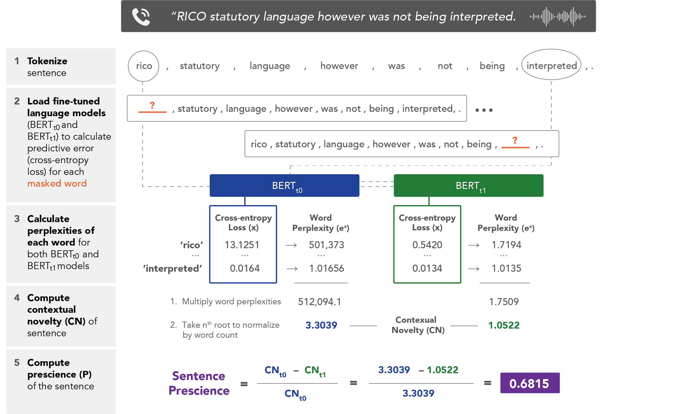
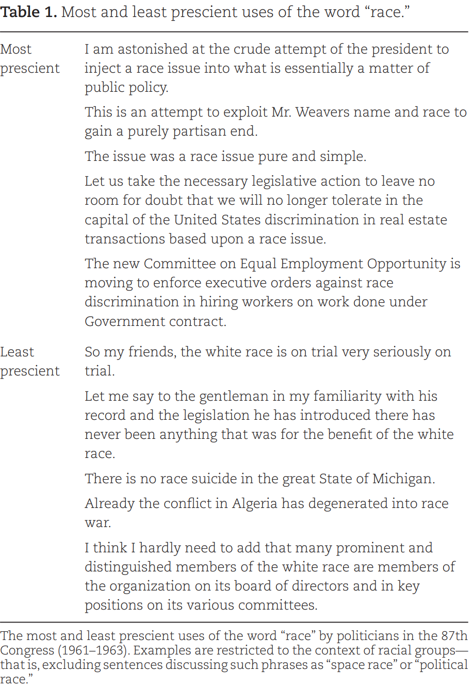

# Prescience
This respository provides the and an introductory tutorial to quantify prescient ideas in natural language as published in:

Paul Vicinanza, Amir Goldberg, Sameer B Srivastava, A deep-learning model of prescient ideas demonstrates that they emerge from the periphery, *PNAS Nexus*, Volume 2, Issue 1, January 2023, pgac275, https://doi-org.stanford.idm.oclc.org/10.1093/pnasnexus/pgac275

# Overview 

We propose a simple measure to identify prescient ideas in natural language using finetuned transformer models (e.g., BERT). By finetuning separate model on a temporally split corpus, we learn time-specific discourse. We identify prescient politicians, judges, and firms as individuals and groups who use language that is poorly predicted by a model trained on contemporaenous text but well-predicted on a model trained on future text. The following figure is an illustration of our model:

 

The principle advantage of this model is that it enables researchers to study variation in a given word within a specific time period and between actors. For example, here are the most and least prescient uses of the word **race** by politicans in the 1961 to 1963 United States Congress.

  

# Implementation

We provide a easy to follow [tutorial in jupyter notebook](./src/prescience_notebook_example.ipynb) demonstrating how to compute prescience on your own corpora. 

1. Finetune custom BERT models over a temporally split corpus
2. Compute prescience using the finetuned BERT models
3. Analyze prescience to understand what the model deems prescient

## GPU Acceleration

This code has PyTorch dependencies and is best run on GPU. You should install the correct version of PyTorch from [their website](https://pytorch.org/get-started/locally/). It has been tested on torch=1.6.0 and cuda=10.2.
